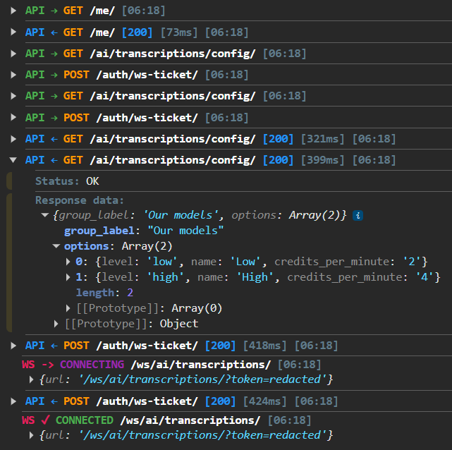

<div align="center">
  <h1>cutie-logs</h1>
  
  <a href="./README.md">
    
  </a>
  <a href="./docs/README.ru.md">
    
  </a>
</div>


Pretty console logging for Axios and WebSocket traffic.

## Install

```bash
npm install cutie-logs
```

Axios logging is optional. Install Axios in your app if you use `cutie-logs/axios`:

```bash
npm install axios
```

## Axios

```ts
import axios from 'axios';
import {attachAxiosLogger} from 'cutie-logs/axios';

const api = axios.create({
    baseURL: '/api/v1',
    withCredentials: true,
});

attachAxiosLogger(api, {
    enabled: process.env.NEXT_PUBLIC_API_LOGGING !== 'false',
    label: 'API',
    maxPayloadKB: 100,
    logRequestsDelay: true,
    logRequestsTime: true,
    stripUrlPrefixes: ['http://localhost:8000', 'https://xlartas.com'],
});
```

`attachAxiosLogger` returns a cleanup function:

```ts
const detach = attachAxiosLogger(api);
detach();
```

## WebSocket

WebSocket logging is explicit because patching global `WebSocket` is too magical for application code.

```ts
import {createWsLogger} from 'cutie-logs/ws';

const wsLogger = createWsLogger({
    enabled: process.env.NEXT_PUBLIC_API_LOGGING !== 'false',
    label: 'WS',
    maxPayloadKB: 100,
    stripUrlPrefixes: ['ws://localhost:8000', 'wss://xlartas.com'],
});

wsLogger.connecting('/ws/chat/', url);
const ws = new WebSocket(url);

ws.onopen = () => wsLogger.open('/ws/chat/', url);
ws.onclose = (event) => wsLogger.close('/ws/chat/', event.code, event.reason);
ws.onerror = (event) => wsLogger.error('/ws/chat/', event);
ws.onmessage = (event) => {
    const payload = JSON.parse(event.data);
    wsLogger.message('/ws/chat/', payload.event ?? 'message', payload);
};
```

## Options

```ts
type CutieLogOptions = {
    enabled?: boolean;
    label?: string;
    maxPayloadKB?: number | null;
    redactFields?: readonly string[];
    stripUrlPrefixes?: readonly string[];
    logRequestsDelay?: boolean;
    logRequestsTime?: boolean;
    timeLocale?: string;
    timestampFormatter?: (date: Date) => string;
    console?: Pick<Console, 'log' | 'error' | 'warn' | 'groupCollapsed' | 'groupEnd'>;
    colors?: Partial<CutieLogColors>;
};
```

- `enabled` defaults to `true`.
- `label` defaults to `API` for Axios and `WS` for WebSocket.
- `maxPayloadKB` defaults to `null`, so payloads are not truncated.
- `redactFields` defaults to common sensitive fields such as `password`, `access`, `refresh`, `token`, `authorization`,
  `api_key`, and `secret`.
- `stripUrlPrefixes` removes noisy URL prefixes from logs, for example `http://localhost:8000`.
- `logRequestsDelay` shows response/error delay such as `[124ms]`. It defaults to `false`.
- `logRequestsTime` shows the current browser-local time. It defaults to `true`.
- `timestampFormatter` overrides the default `HH:MM` browser-local time formatter.
- `console` is mainly for tests or custom environments.

## Exports

```ts
import {attachAxiosLogger} from 'cutie-logs/axios';
import {createWsLogger} from 'cutie-logs/ws';
import {sanitizePayload, formatPayload} from 'cutie-logs';
```

## Development

```bash
npm ci
npm run check
npm test
npm run build
npm run pack:dry-run
```

## Release

See [Release Guide](./docs/RELEASE_GUIDE.md).
